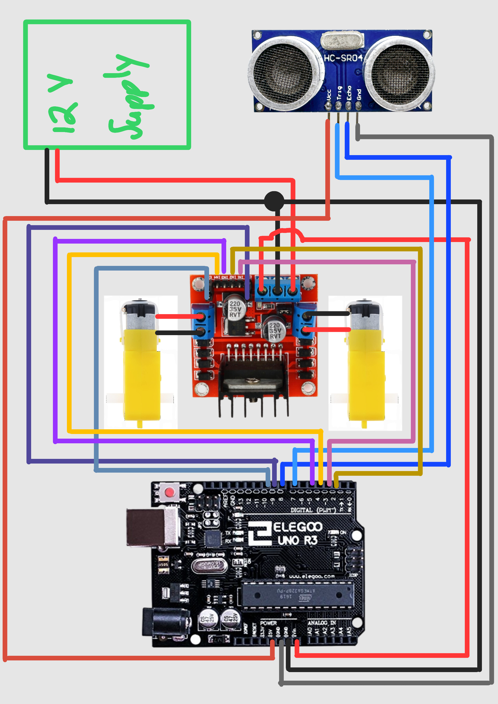

# Collision Avoidance Robot

A simple robot that automatically stops when an obstacle is detected within 20cm.

## How It Works

The HC-SR04 ultrasonic sensor continuously measures the distance to objects in front of the robot. When an obstacle is detected within 20cm, the Arduino sends a signal to the L298N motor driver to stop the motors. When the path is clear, the robot resumes moving forward.

## Components

| Component | Model | Quantity | Purpose |
|---|---|---|---|
| Microcontroller | Arduino Uno R3 | 1 | Processes sensor data and controls motor driver |
| Motor Driver | L298N | 1 | Controls the speed and direction of the motors |
| Ultrasonic Sensor | HC-SR04 | 1 | Detects obstacles and measures distance |
| Chassis | 2WD Robot Chassis | 1 | Structural base and drive system |
| Power Supply | 12V Battery | 1 | Powers the motors and electronics |

## Pin Connections

### L298N Motor Driver
| L298N Pin | Connected To | Purpose |
|---|---|---|
| 12V | Power Supply (+) | Motor power input |
| GND | Power Supply GND / Arduino GND | Common ground |
| 5V | Arduino Vin | Powers the Arduino |
| IN1 | Arduino D3 | Right motor direction |
| IN2 | Arduino D2 | Right motor direction |
| IN3 | Arduino D5 | Left motor direction |
| IN4 | Arduino D4 | Left motor direction |
| OUT1 | Right Motor (+) | Right motor output |
| OUT2 | Right Motor (-) | Right motor output |
| OUT3 | Left Motor (+) | Left motor output |
| OUT4 | Left Motor (-) | Left motor output |
| ENA | Arduino D9 | Right motor speed PWM |
| ENB | Arduino D10 | Left motor speed PWM |

### HC-SR04 Ultrasonic Sensor
| Sensor Pin | Connected To | Purpose |
|---|---|---|
| Vcc | Arduino 5V | Sensor power |
| Trig | Arduino D7 | Trigger pulse output |
| Echo | Arduino D8 | Distance measurement input |
| GND | Arduino GND | Common ground |

## Schematic
<figure>
  
  <figcaption>Wiring Schematic</figcaption>
</figure>

## Scope and Limitations
- Stop/go logic only — no steering around obstacles
- Detection range capped at 20cm
- Forward-facing sensor only, no peripheral detection

## Built With
- Arduino IDE
- C++

## Author
Elohim Dzangare — 05.2026
